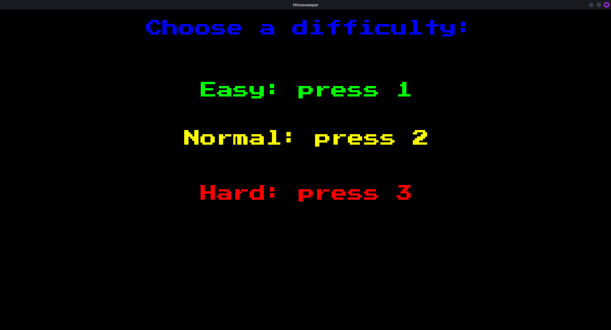
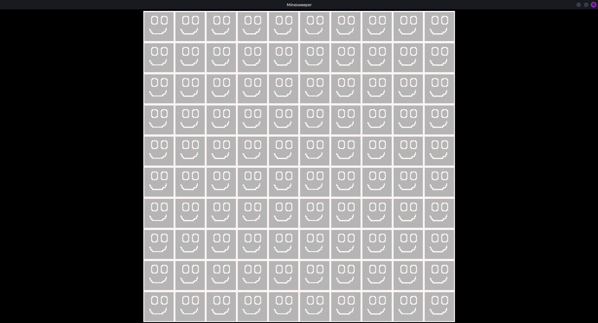
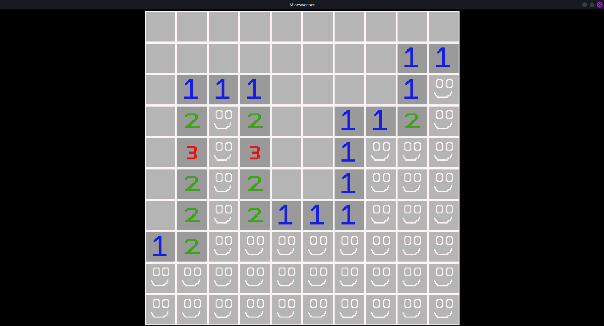
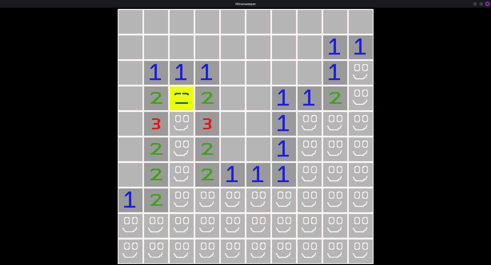

# Minesweeper

## Table of Contents 

1. [Overview](#overview)
2. [What the game looks like](#what-the-game-looks-like)
3. [How to Play](#how-to-play)
4. [How to Run](#how-to-run)

## Overview

Minesweeper is a game where you have to reveal all correct tiles to win the game. Project utilizes SFML and is programmed in C++.

## What the game looks like

* After successfully running the program the menu window will appear that allows to choose difficulty of the game by pressing corresponding key on keyboard:



It is possible that text: "Choose a difficulty:" might not fit correctly (there is a plan to fix it in the future).


* Choosing the difficulty transports the user to the game window:


By left clicking the tile it will reveal itself allowing user to start the game. On the other hand right clicking the tile will block it from revealing (left clicking) until not right clicked again. 

* Picture below shows the effect of left click (reveal tile):


* Picture below shows the effect of the right click (flag the tile):


* If you win or lose the corresponding message will appear few seconds after the game ends.

* The bomb looks like this:


## How to play

The instructions on how to play Minesweeper can be found all over internet (for example [Wikipedia](https://en.wikipedia.org/wiki/Minesweeper_(video_game))).

## How to Run 

### On Linux

1. First, you have to clone this repository and go into it:

```
git clone https://github.com/Gab071/Minesweeper.git
cd Minesweeper
```

2. Install SFML, CMake, and build tools (if not already installed):
```
sudo apt install libsfml-dev cmake build-essential
```


3. Then build the project (in the Minesweeper folder you just cloned):
```
cmake -B build
cmake --build build
```

4. Run the game (must be run from inside the build directory for assets to load properly):
```
cd build
./Minesweeper
```

Note: Step 4 is done this way because of the relative assest path (like *PressStart2P-Regular.ttf*)


